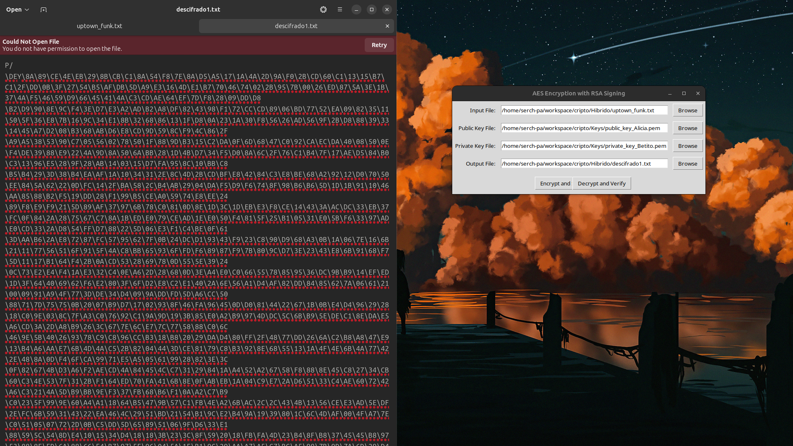
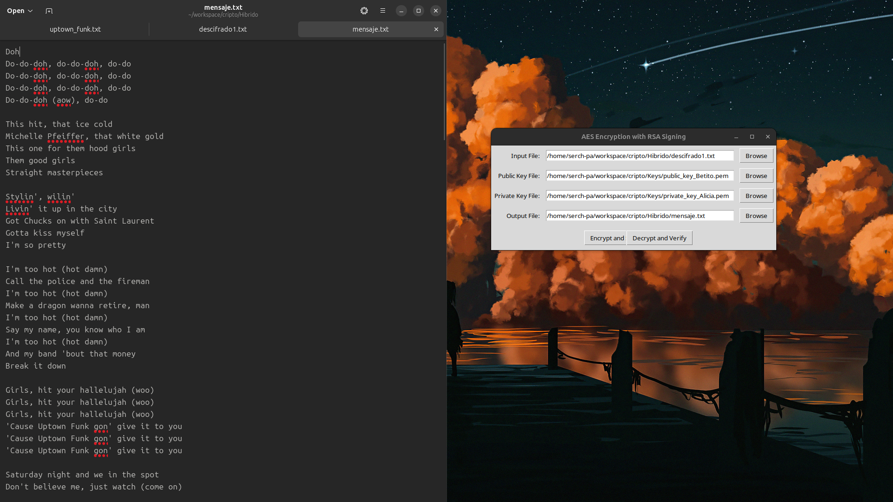
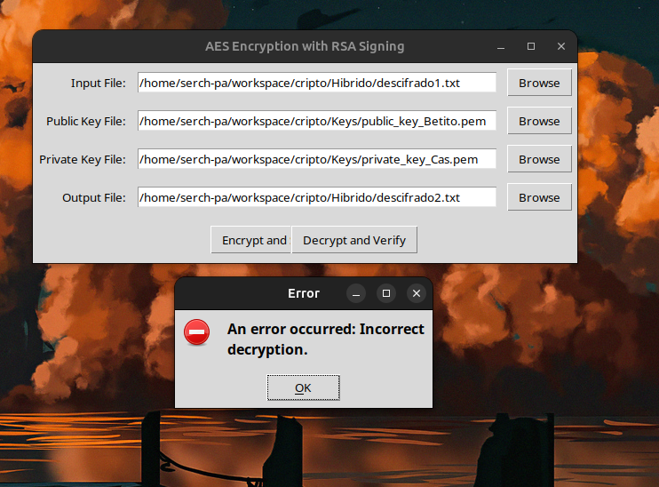
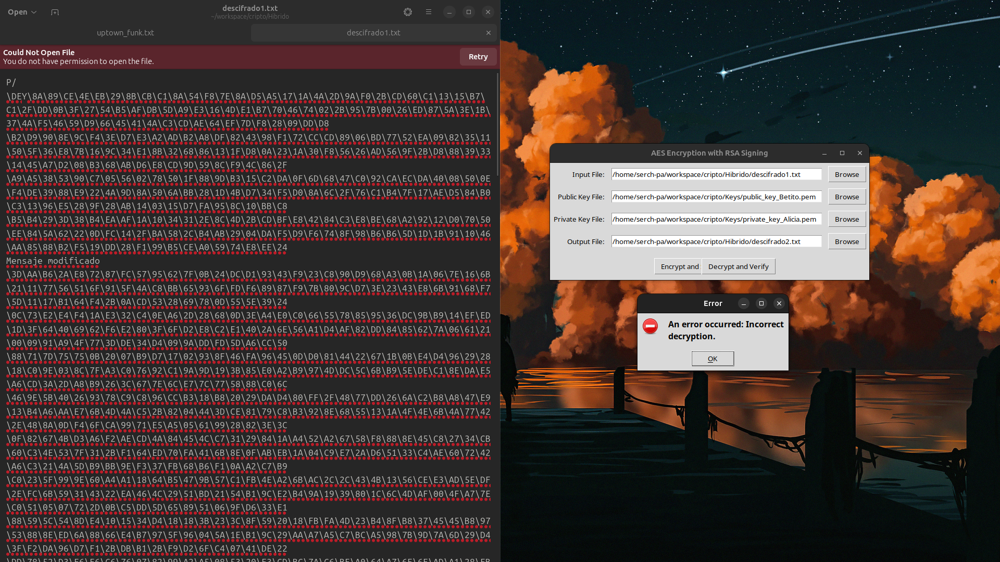

# cifrado_archivos
Cifrado de archivos txt en Python utilizando criptografía híbrida.

La criptografía híbrida es el uso de diferentes algortimos criptográficos para poder lograr diferentes propiedades de la ciberseguridad de los activos. 
Este programa nos permite, mediante el uso de diferentes algoritmos, poder cifrar y firmar un archivo de extensión **txt** con claves públicas y privadas, además de poder descifrar y verificar correctamente dichos archivos.

*Antes de hacer uso del programa, se deben generar claves públicas y privadas de 2048 bytes para todas las partes, para así poder cifrar, descifrar y verificar correctamente los archivos.*

El funcionamiento del programa está descrito de la siguiente manera...

Se ingresan las direcciones de los siguientes requerimientos:

**Archivo de Mensaje en .txt**, **Archivo de Salida del cifrado/descifrado**

**Para cifrar:** Llave Privada del Emisor para Firmar, Llave Pública del Receptor para Cifrar 
**Para descifrar:** Llave Privada del Receptor para Descifrar, Llave Pública del Emisor para Verificar

## Cifrado y Firma

Se genera una llave y vector de entrada aleatorios para cifrar la información del archivo mediante AES-128 utilizando el modo CBC. 
Utilizando RSA y la Llave Pública del Receptor, se cifra la llave generada anteriormente. 
Se utiliza SHA-256 para generar un digesto del mensaje y medienta RSA se cifra utilizando la Llave Privada del Emisor que servirá como firma.

Se genera un nuevo archivo que contiene en orden:

**Vector aleatorio de entrada** 
**Llave aleatoria cifrada** 
**Firma** 
**Texto Cifrado**

## Descifrado y Verificación

Se descifra la llave con RSA utilizando la Llave Privada del Receptor. 
Utilizando AES, el vector de entrada y la llave descifrada anteriormente, se descifra el mensaje. 
Utilizando la Llave Pública del Emisor, se descifra la firma. 
Se utiliza SHA-256 para generar un digesto del mensaje descifrado, de forma que, la firma descifrada anteriormente y el digesto deban ser idénticos.

## Errores
Si se llegan a utilizar diferentes llaves para descifrar o verificar la procedencia del archivo, se arrojará un error de autenticación, indicando que las llaves que se están utilizando son incorrectas.

Si se modifica el archivo cifrado y después se intenta descifrar utilizando las llaves adecuadas, se indicará un error en el que no se puede realizar correctamente el descifrado.

# Algoritmos Utilizados

## AES

Se utiliza el algoritmo AES en su versión de 128 bits, generando una clave y un vector de entrada aleatorios de este tamaño para poder cifrar la información. Se utiliza el modo de cifrado en CBC que es uno de los modos más seguros de cifrar utilizando AES. Este algoritmo nos permite ofrecer integridad, debido a que si la información es modificada, el archivo no se descifrará correctamente y confidencialidad parcial debido a que asegura que solo quien conozca el vector de entrada y la llave utilizada, podrá descifrar el archivo correctamente.

## RSA

Se utiliza el algoritmo de RSA con claves privadas de 2048 bits generadas de manera aleatoria. Estas son útiles para poder cifrar la llave utilizada en el algoritmo de AES, de esta forma, no se puede obtener de manera directa la llave, haciendo complicado que se pueda obtener la información en crudo. Este algoritmo nos ofrece confidencialidad debido a que se tiene una clave privada que cada usuario puede resguardar para poder cifrar y descifrar la llave utilizada para cifrar la información.

## SHA

Se utiliza el algoritmo de SHA en su versión de 256 bits el cual nos permite crear un digesto de la información para poder verificar si la información fue modificada, además de permitirnos poder firmar el documento o verificar la firma de este. Este algoritmo nos permite ofrecer Verificación y No Repudio debido a que este se firma con una llave privada, haciendo que al momento de hacer una verificación correcta, se asegura que la persona que la firmó, es quien dice ser y no puede rechazar esto, a menos que su llave privada haya sido expuesta. Además ofrece integridad debido a que se puede verificar si el contenido del archivo fue modificado, ya que se utilizan funciones que si un bit es cambiado, el digesto se modifica en su totalidad.

